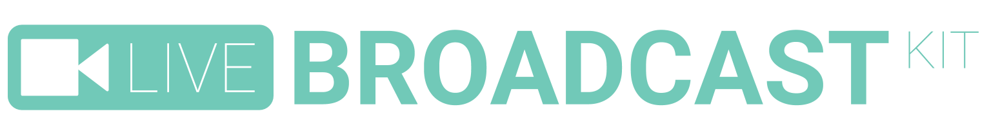

<p align="center">
    <br />
    
    
</p>

# About

**Live Broadcast Kit** (LBK) is a web app to easily and effortlessly create overlays for video content. It has been originally designed to work in conjunction with [OBS](https://obsproject.com) to add and control overlays on live feeds, however it can be used as a standalone app as well.

> **NOTICE:** the app can be used directly in your browser at [livebk.app.uffs.cc](https://livebk.app.uffs.cc). If you want to see it in action (results), check out [this YouTube video](https://youtu.be/ZgWojT5qlpc).

LBK has been developed to help with broadcast and video content creation within the [Computer Science program](https://cc.uffs.edu.br) at [Federal University of Fronteira Sul](https://www.uffs.edu.br), Chapecó, Brazil.

## Features

You can use LBK to create different types of content, not only overlays. For instance, use it to create intros/outros for YouTube, social media clips, etc. Out of the box, it contains the following features:

* Web app (no instalations, runs directly in the browser);
* Create and control how items are displayed;
* Wide variety of ready-to-use overlays and effects;


## Getting started

The following sections explain how to use LBK in different ways.

### Use as a web page (standalone)

The fastest and easiest way of using LBK is accessing [livebk.app.uffs.cc](https://livebk.app.uffs.cc). It will work in your browser without any instalation or dependencies. Use the control panel to create content, e.g. overlays or clips for your videos, then record it and add to your video project.

### Use with OBS

When using [OBS](https://obsproject.com), for live broadcasting or recording, add a [Browser Source]https://obsproject.com/wiki/Sources-Guide#browsersource). Set the URL of your browser source as [https://livebk.app.uffs.cc](https://livebk.app.uffs.cc). Then, use your browser window/tab with LBK to control the content displayed on OBS (within the browser source).

### Use with Streamlabs OBS

When using [Streamlabs OBS](https://streamlabs.com), for live broadcasting or recording, add a [Browser Source Interaction](https://blog.streamlabs.com/introducing-browser-source-interaction-for-streamlabs-obs-d8fc4dcbb1fb). Set the URL of your browser source as [https://livebk.app.uffs.cc](https://livebk.app.uffs.cc). Then, interact with LBK right within the Streamlabs OBS screen.

## Development

This section is intended for contributors who plan on adding features, documentation, fixing bugs, etc. If you just want to use LBK, check the previous section or head to [https://livebk.app.uffs.cc](https://livebk.app.uffs.cc).

### 1. Prerequisites

Before you begin, ensure you have a machine with git, node and npm. LBK already comes with all the libs it needs for basic operations, so node and npm are not totally required. 

You only need a web server or a way of servering LBK as a web page. Node and npm might help though.

### 2. Installing dependencies

Clone this repo:

```
git clone https://github.com/ccuffs/live-broadcast-kit && cd live-broadcast-kit
```

Install all JS libs using npm (if you plan on working on the features that depend on them):

```
npm install
```

### 3. Running the app

If you are using node/npm, at the root of the project folder, run:

```
npm serve
```

Point your browser to the provided link and start tinkering.

## Contribute

Your help is most welcome regardless of form! Check out the [CONTRIBUTING.md](CONTRIBUTING.md) file for all ways you can contribute to the project. For example, [suggest a new feature](https://github.com/ccuffs/live-broadcast-kit/issues/new?assignees=&labels=&template=feature_request.md&title=), [report a problem/bug](https://github.com/ccuffs/live-broadcast-kit/issues/new?assignees=&labels=bug&template=bug_report.md&title=), [submit a pull request](https://help.github.com/en/github/collaborating-with-issues-and-pull-requests/about-pull-requests), or simply use the project and comment your experience. You are encourage to participate as much as possible, but stay tuned to the [code of conduct](CODE_OF_CONDUCT.md) before making any interaction with other community members.

See the [ROADMAP.md](ROADMAP.md) file for an idea of how the project should evolve.

## License

This project is licensed under the [MIT](https://choosealicense.com/licenses/mit/) open-source license and is available for free.

## Changelog

See all changes to this project in the [CHANGELOG.md](CHANGELOG.md) file.

## Similar projects

Below is a list of interesting links and similar projects:

* [Open Broadcaster Software (OBS)](https://obsproject.com)
* [Streamlabs OBS](https://streamlabs.com)
* [Pixabay](https://pixabay.com/videos)
* [Coverr](https://coverr.co)
* [Green Screen Brasil](https://www.youtube.com/channel/UCk90quCzMYSp36ZfWeov3Dg)
